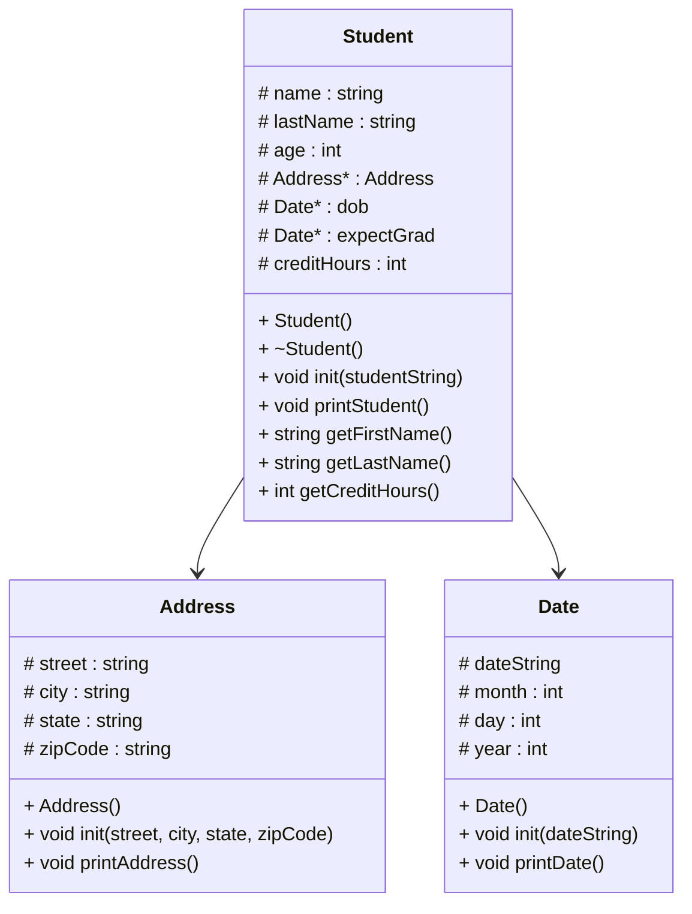

# Heap of students

```mermaid
classDiagram

class Student{
  # name : string
  # lastName : string
  # age : int
  # Address* : Address
  # Date* : dob
  # Date* : expectGrad
  # creditHours : int
  + Student()
  + ~Student()
  + void init(studentString)
  + void printStudent()
  + string getFirstName()
  + string getLastName()
  + int getCreditHours()
}

Student --> Address
Student --> Date

class Address{
  # street : string
  # city : string
  # state : string
  # zipCode : string
  + Address()
  + void init(street, city, state, zipCode)
  + void printAddress()
}

class Date{
  # dateString
  # month : int
  # day : int
  # year : int
  + Date()
  + void init(dateString)
  + void printDate()

}
```
